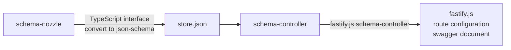

# @maeum/schema-controller


[](https://npmcharts.com/compare/@maeum/schema-controller)
[](https://github.com/imjuni/@maeum/schema-controller)
[](https://github.com/imjuni/@maeum/schema-controller/issues)
[](https://www.npmjs.com/package/@maeum/schema-controller)
[](https://github.com/imjuni/@maeum/schema-controller/actions/workflows/ci.yml)
[](https://github.com/imjuni/@maeum/schema-controller/blob/master/LICENSE)
[](https://codecov.io/gh/imjuni/@maeum/schema-controller)
[](https://github.com/prettier/prettier)

The `@maeum/schema-controller` is a package that helps developer to integreate [schema-nozzle](https://github.com/imjuni/schema-nozzle) and [fastify.js](https://fastify.dev/). Developer can generate a `json-schema` via schema-nozzle and then use as a schema in fastify.js request/response.

Why use `@maeum/schema-controller`?

- You can decouple the schema-controller from fastify.js
- Less effort to set up route configuration in fastify.js
- You can add json-schema validation to messages received from MQ (RabbitMQ, ActiveMQ, SQS, etc), server configurations, and anywhere else you want.

## Table of Contents <!-- omit in toc -->

- [Getting Started](#getting-started)
  - [installation](#installation)
  - [Configuration](#configuration)
- [How to work?](#how-to-work)
- [Custom ajv Options](#custom-ajv-options)
- [Relate To](#relate-to)
- [License](#license)

## Getting Started

### installation

```bash
npm install @maeum/schema-controller --save
```

### Configuration

```ts
import fastify from 'fastify';
import { bootstrap as schemaBootstrap, getSchemaController } from '@maeum/schema-controller';

const listen = () => {
  // step 01. bootstrap your json-schema database
  schemaBootstrap({
    // set your json-schema database file-path
    filePath: path.join(getCwd(process.env), 'resources', 'configs', 'store.json'),
  });

  const server = fastify()

  // step 02. your schema controller pass to fastify.js
  server.setSchemaController(getSchemaController(server));
}

listen();
```

## How to work?

The `schema-nozzle` generate as json-schema database file that is available in `@maeum/schema-controller`. This generated json-schema database file is read from `@ameum/schema-controller` and then use to set up the schema in fastify.js routing.

```ts
server.post('/pet', { schema: { querystring: { $ref: 'ICreatePetDto' } } }, (req: FastifyRequest<{ Querystring: ICreatePetDto }>, reply) => {
  // ...your code
  // You can use auto-complete and intellisence Request Object like that,
  // `req.query.name`
})
```



## Custom ajv Options

fastify.js uses [ajv](https://ajv.js.org/) for request data validation. If you want to change the options of the ajv instance, you can pass custom options as shown below.

```ts
schemaBootstrap({
    filePath: path.join(getCwd(process.env), 'resources', 'configs', 'store.json'),
    ajv: {
      // custom option of ajv instance
      options: {
        coerceTypes: 'array',
        keywords: ['collectionFormat', 'example', 'binary'],
        formats: {
          binary: { type: 'string', validate: () => true },
          byte: { type: 'string', validate: () => true },
        },
      },
      // extension apply on ajv
      extension: (ajv) => ajvFormat(ajv),
    },
  });
```

## Relate To

- [schema-nozzle](https://github.com/imjuni/schema-nozzle)
  - json-schema database generator
- [ts-json-schema-generator](https://github.com/vega/ts-json-schema-generator)
  - json-schema generator
- [ts-morph](https://github.com/dsherret/ts-morph)
  - TypeScript Compiler API wrapper

## License

This software is licensed under the [MIT](https://github.com/imjuni/schema-nozzle/blob/master/LICENSE).
